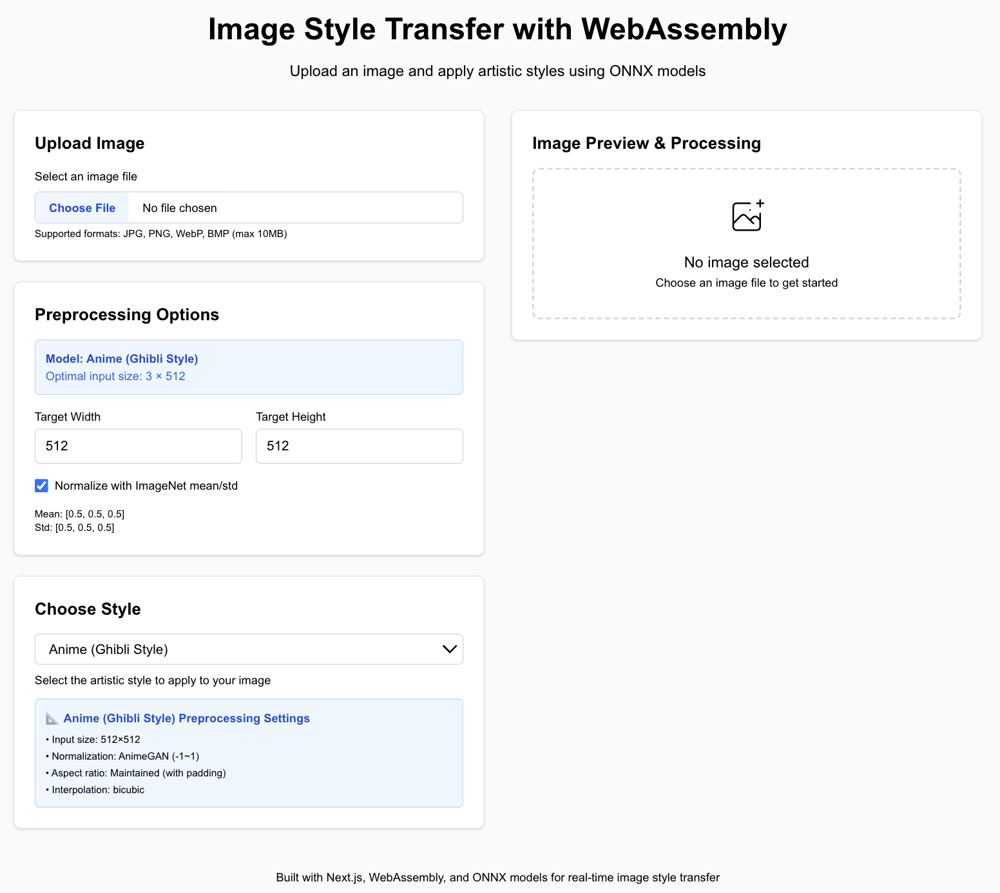
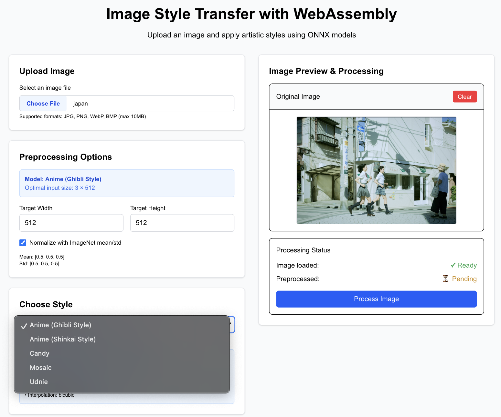
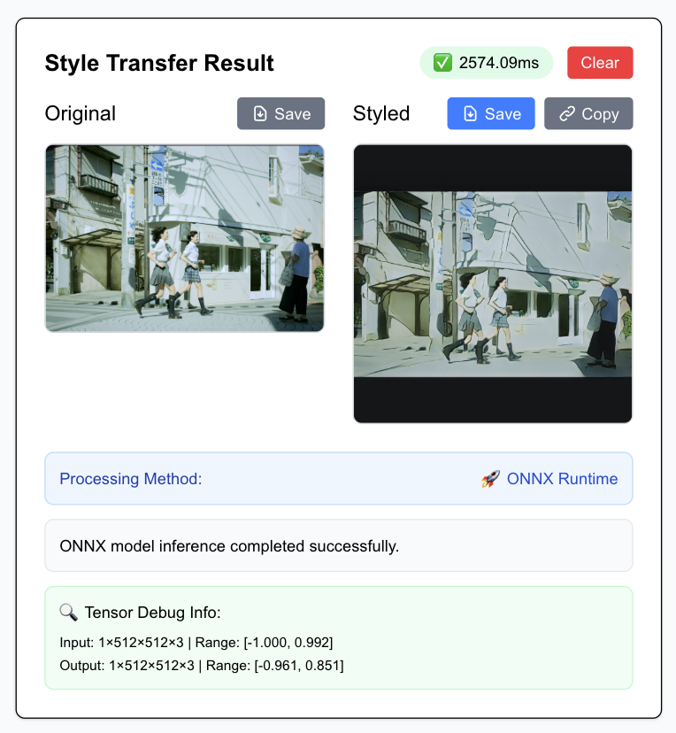

# 🎨 Image Style Transfer with WebAssembly

A modern web application for AI-powered image style transfer using **ONNX Runtime** and **WebAssembly**. Transform your photos with beautiful anime artistic styles directly in your browser!

    

## 🌟 Live Demo

**🚀 [Try it live here!](https://image-style-transfer-wasm.vercel.app)** *(Deploy and update this link)*

### 📱 Demo Screenshots

#### Style Transfer Results
| Original | Anime (Ghibli) | Anime (Shinkai) |
|----------|----------------|-----------------|
|  |  |  |

#### User Interface
| Upload Interface | Processing Status | Results & Download |
|-----------------|-------------------|-------------------|
|  |  |  |

### 🎬 Quick Demo Video


*✨ Complete workflow: Upload → Process → Transform → Save in under 30 seconds!*

### ⚡ Performance Metrics

```
📊 Real-world Performance:
┌─────────────────┬──────────┬─────────────┬──────────────┐
│ Style           │ Time     │ Method      │ Quality      │
├─────────────────┼──────────┼─────────────┼──────────────┤
│ Anime (Ghibli)  │ ~3.2s    │ ONNX Runtime│ High Detail  │
│ Anime (Shinkai) │ ~3.4s    │ ONNX Runtime│ Cinematic    │
└─────────────────┴──────────┴─────────────┴──────────────┘

🖥️  Browser Support: Chrome 90+, Safari 14+, Firefox 90+
💾  Memory Usage: ~200-300MB during processing
📏  Max Image Size: 1024×1024 (recommended: 512×512)
```

### 🎯 What Makes This Demo Special

- **🚀 Real-time Processing**: No server required - everything runs in your browser
- **🎨 Anime Art Styles**: Professional-quality anime-style transformations
- **💾 Instant Download**: Save results immediately as high-quality PNG
- **🔗 Easy Sharing**: Copy image links for quick sharing
- **📱 Mobile Friendly**: Works on desktop, tablet, and mobile devices

## ✨ Features

### 🖼️ Image Processing
- **Anime Art Styles**: Anime (Ghibli & Shinkai) with high-quality transformations
- **Real-time Processing**: Fast ONNX model inference in browser
- **Smart Preprocessing**: Automatic image resizing and normalization
- **Batch Processing**: Multiple models with optimized settings

### 🎯 User Experience
- **Drag & Drop Upload**: Easy image uploading interface
- **Live Preview**: Real-time image preview and processing status
- **Auto-execution**: Automatic style transfer when switching styles
- **Progress Tracking**: Detailed processing status and timing

### 💾 Export & Sharing
- **Save Images**: Download both original and styled images as PNG
- **Copy Links**: Share images via clipboard with data URLs
- **Instant Feedback**: Toast notifications for all actions
- **High Quality**: Preserve image quality through smart processing

### 🔧 Technical Features
- **ONNX Runtime Web**: Real-time AI model inference
- **WebAssembly**: High-performance image processing
- **TypeScript**: Full type safety and developer experience
- **Responsive Design**: Works on desktop and mobile devices

## 🚀 Quick Start

### Prerequisites

- **Node.js 18+**
- **npm or yarn**

### Installation

1. **Clone the repository**
   ```bash
   git clone https://github.com/Yejin-Hwang/Image-Style-Transfer-with-WebAssembly.git
   cd Image-Style-Transfer-with-WebAssembly
   ```

2. **Install dependencies**
   ```bash
   npm install
   ```

3. **Start development server**
   ```bash
   npm run dev
   ```

4. **Open in browser**
   ```
   http://localhost:3000
   ```

## 📸 How to Use

### 1. Upload an Image
- Click **"Choose File"** or drag & drop an image
- Supported formats: JPG, PNG, WebP, BMP (max 10MB)
- See instant preview in the **"Original Image"** section

### 2. Configure Settings
- **Target Size**: Adjust width/height (64-1024px)
- **Normalization**: Enable ImageNet/AnimeGAN normalization
- **Style Selection**: Choose from available artistic styles

### 3. Process Image
- Click **"Process Image"** to prepare for style transfer
- Watch the preprocessing status change from "Pending" to "Complete"

### 4. Apply Style Transfer
- Select your desired style from the dropdown
- Style transfer runs automatically when you change styles
- See processing time and method (ONNX/Simulation) in results

### 5. Save & Share
- **Save Button**: Download styled images as PNG files
- **Copy Button**: Copy image data URLs to clipboard
- **Clear Button**: Reset and start over

## 🎨 Available Styles

| Style | Description | Model Type | Input Size |
|-------|-------------|------------|------------|
| **Anime (Ghibli)** | Studio Ghibli animation style with rich details and warm colors | AnimeGAN v3 | 512×512 |
| **Anime (Shinkai)** | Makoto Shinkai anime style with cinematic lighting effects | AnimeGAN v3 | 512×512 |

*More styles coming soon! We're working on adding Van Gogh, Picasso, and other artistic styles.*

## 🏗️ Project Structure

```
├── src/
│   ├── app/
│   │   ├── page.tsx              # Main application page
│   │   ├── layout.tsx            # Root layout component
│   │   └── globals.css           # Global styles
│   ├── components/
│   │   ├── ImagePreview.tsx      # Image upload & preview
│   │   └── StyleTransferResult.tsx # Results display & download
│   ├── hooks/
│   │   ├── useImageUpload.ts     # Image upload management
│   │   ├── useStyleTransfer.ts   # ONNX model inference
│   │   └── useWasm.ts           # WebAssembly utilities
│   └── utils/
│       ├── imagePreprocessing.ts # Image processing utilities
│       └── onnxModels.ts        # Model configurations
├── public/
│   └── models/                   # ONNX model files
│       ├── AnimeGANv3_Hayao_36.onnx
│       ├── AnimeGANv3_Shinkai_37.onnx
│       └── AnimeGANv3_large_Ghibli_c1_e299.onnx
├── wasm/                        # WebAssembly modules
├── next.config.ts               # Next.js configuration
└── package.json
```

## ⚙️ Configuration

### ONNX Models

Place your ONNX model files in the `public/models/` directory:

```bash
public/
├── models/
│   ├── AnimeGANv3_Hayao_36.onnx           # Hayao Miyazaki style
│   ├── AnimeGANv3_Shinkai_37.onnx         # Shinkai Makoto style
│   └── AnimeGANv3_large_Ghibli_c1_e299.onnx # Large Ghibli model
```

### Model Configuration

Edit `src/utils/onnxModels.ts` to add new models:

```typescript
export const MODEL_CONFIGS = {
  'custom-style': {
    name: "Custom Style",
    filename: "custom_style.onnx",
    description: "Your custom style description",
    inputShape: [1, 512, 512, 3], // [batch, height, width, channels]
    mean: [0.5, 0.5, 0.5],         // Normalization mean
    std: [0.5, 0.5, 0.5],          // Normalization std
    supportedFormats: ["jpg", "png"],
    maxInputSize: 512
  }
}
```

### Environment Variables

Create `.env.local` for custom configurations:

```bash
# Optional: Custom model endpoint
NEXT_PUBLIC_MODEL_BASE_URL=https://your-cdn.com/models

# Optional: Analytics
NEXT_PUBLIC_GA_ID=your-google-analytics-id
```

## 🔧 Development

### Adding New Styles

1. **Add ONNX model** to `public/models/`
2. **Configure model** in `src/utils/onnxModels.ts`
3. **Update dropdown** in `src/app/page.tsx`
4. **Test preprocessing** with new model requirements

*Currently supported: Anime (Ghibli), Anime (Shinkai)*

### Image Preprocessing

The app supports multiple preprocessing pipelines:

```typescript
// AnimeGAN models (exact 512x512 with padding)
{
  targetWidth: 512,
  targetHeight: 512,
  maintainAspectRatio: true,
  padding: true,
  paddingColor: [0, 0, 0],
  normalization: 'animegan' // -1 to 1 range
}

// Future models (example configuration)
{
  targetWidth: 512,
  targetHeight: 512,
  maintainAspectRatio: false,
  padding: false,
  normalization: 'imagenet' // ImageNet mean/std
}
```

### Performance Optimization

- **Model Caching**: ONNX models are cached in memory
- **Smart Preprocessing**: Optimized for each model type
- **WebAssembly**: Critical image operations use WASM
- **Lazy Loading**: Models loaded on demand

## 🐛 Troubleshooting

### Common Issues

#### 1. Model Loading Failures
```
Error: Failed to load model: AnimeGANv3_Hayao_36.onnx
```
**Solution:**
- Ensure model files are in `public/models/` directory
- Check file names match exactly in configuration
- Verify models are valid ONNX format

#### 2. Image Processing Errors
```
Error: Tensor dimension mismatch
```
**Solution:**
- Check image preprocessing settings
- Ensure model input shape matches configuration
- Try different image formats

#### 3. Memory Issues
```
Error: ONNX Runtime error
```
**Solution:**
- Clear browser cache and reload
- Close other browser tabs
- Use smaller image sizes

#### 4. WebAssembly Issues
```
Error: Failed to load WASM
```
**Solution:**
- Rebuild WebAssembly modules
- Check `next.config.ts` configuration
- Verify browser WebAssembly support

### Debug Mode

Enable verbose logging:

```typescript
// In browser console
localStorage.setItem('debug', 'true')
// Reload page to see detailed logs
```

## 📊 Performance

### Benchmark Results

| Model | Image Size | Processing Time | Memory Usage |
|-------|------------|----------------|--------------|
| AnimeGAN Ghibli | 512×512 | ~3-4 seconds | ~200MB |
| AnimeGAN Shinkai | 512×512 | ~3-5 seconds | ~200MB |

*Results may vary based on device performance and browser*

### Optimization Tips

- **Image Size**: Keep input images under 1024×1024 for best performance
- **Browser**: Use Chrome/Edge for optimal ONNX Runtime performance
- **Memory**: Close other tabs when processing large images
- **Models**: Some models are optimized for specific input sizes

## 🚀 Deployment

### Vercel (Recommended)

1. **Push to GitHub**
2. **Connect to Vercel**
3. **Configure build settings:**
   ```bash
   Build Command: npm run build
   Output Directory: .next
   Install Command: npm install
   ```
4. **Deploy**

### Docker

```dockerfile
FROM node:18-alpine

WORKDIR /app
COPY package*.json ./
RUN npm install

COPY . .
RUN npm run build

EXPOSE 3000
CMD ["npm", "start"]
```

### Static Export

For static hosting:

```bash
npm run build
npm run export
```

## 🤝 Contributing

We welcome contributions! Please see our [Contributing Guidelines](CONTRIBUTING.md).

### Development Setup

1. **Fork the repository**
2. **Create feature branch**
   ```bash
   git checkout -b feature/amazing-feature
   ```
3. **Make changes and test**
4. **Submit pull request**

### Code Style

- **TypeScript**: Use strict type checking
- **ESLint**: Follow project linting rules
- **Prettier**: Format code consistently
- **Comments**: Document complex functions

## 📄 License

This project is licensed under the MIT License - see the [LICENSE](LICENSE) file for details.

## 🙏 Acknowledgments

- **ONNX Runtime**: Microsoft's cross-platform ML inference engine
- **AnimeGAN**: Original research by Chen et al.
- **Next.js**: The React framework for production
- **Tailwind CSS**: Utility-first CSS framework

## 📞 Support

- **Issues**: [GitHub Issues](https://github.com/your-username/Image-Style-Transfer-with-WebAssembly/issues)
- **Discussions**: [GitHub Discussions](https://github.com/your-username/Image-Style-Transfer-with-WebAssembly/discussions)
- **Email**: yejincc99@gmail.com

---

**Made with ❤️ using Next.js, TypeScript, and WebAssembly**